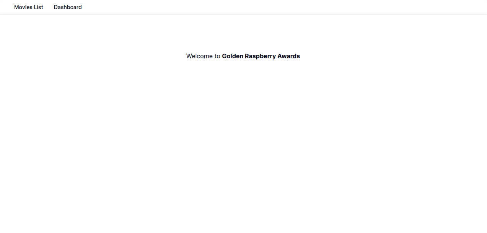
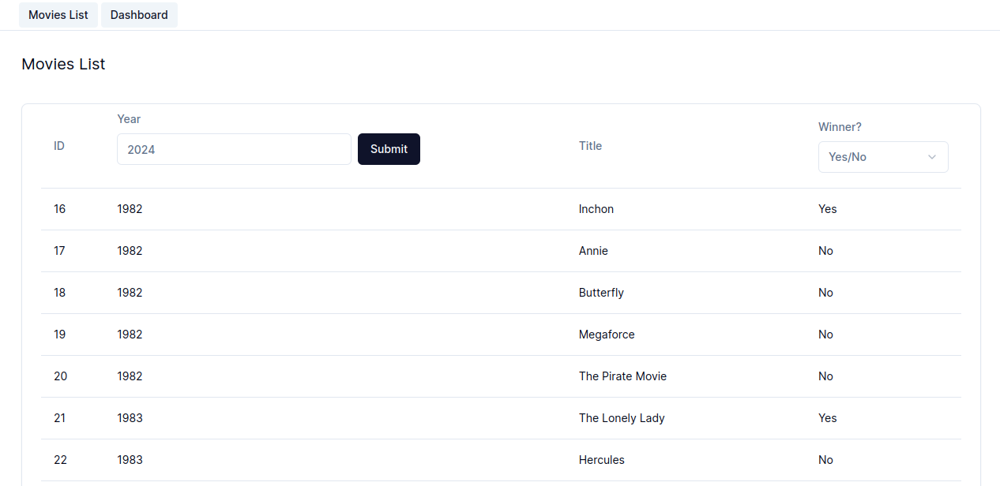
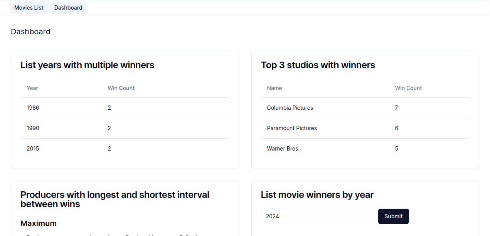

# Project Overview

The purpose of the application is to make it possible to read the list of nominees and winners
in the Worst Film category at the Golden Raspberry Awards





Movies List Screen:

On the Film List screen, you can view a list of all films as well as filtering data by year and winner.



Dashboard Screen:

Features:

- View the years that had more than one winner in a table;
- View the three studios with the most wins in a table
- View in tables the producers with the longest and shortest interval between
  victories;
- View the winners of a given year selected in a table through
  of a search field.

# File Structure and Code Organization

I chose NextJS as the framework because the most up-to-date ReactJS documentation suggests that we use a framework. I also took the opportunity to use the new NextJS architecture that includes React Server Components.

According to the updated NextJS documentation, we have a layout in the /app folder that allows the top menu to be displayed and in this folder we have two pages, the list page and the dashboard.

We use react-hook-forms to control and delegate the state of the forms used in the project.

To test components and interfaces, we use the Vitest and React Testing Library.

I used Shadcn/ui and Tailwind CSS to use components and custom CSS styles and rules.

To fetch data with the API we use Axios.

For porpouses of securtiy, i used Next Public environment variables, that i explain below how can you install and configure in your machine.

## Coding Style and Standards

For lint and code standardization we use Eslint and Prettier.

I recommend that you install the Eslint and Prettier plugins in your Visual Studio Code so that it works properly.

## Routing

The application routing uses the NextJS App Router, which is worth mentioning as it is an innovation in the React ecosystem using the new NextJS Server Components architecture.

## Installation and Configuration

First, clone the project in your computer and install the dependencies using:

```bash
npm install
```

Create a .env file in the root of your project and add a API_URL:

```bash
NEXT_PUBLIC_API_BASE_URL=https://tools.texoit.com/backend-java/api/movies
```

After, run the development server:

```bash
npm run dev
```

Open [http://localhost:3000](http://localhost:3000) with your browser to see the result.

## Unit Testing and Interface Testing

To ensure that the application works with quality, we implemented tests that can be done using the following command:

```bash
npm run test
```

## Vercel Production Website

To deploy the application using Vercel, simply click or push to the Git repository.

Production Website [Vercel Website](https://test-golden-raspberry-awards.vercel.app/)

## FAQ (Frequently Asked Questions)

If you have any questions, I will be happy to answer you via email at [rafaelcostapalma@protonmail.com](mailto:rafaelcostapalma@protonmail.com)

My [Linkedin profile](https://www.linkedin.com/in/rafaelpalma88).

## External docs

- [Next.js](https://nextjs.org/docs)
- [React Hook Form](https://react-hook-form.com/get-started)
- [Vitest](https://vitest.dev/guide/)
- [React Testing Library](https://testing-library.com/docs/)
- [Axios](https://axios-http.com/ptbr/docs/intro)
- [Shadcn/UI](https://ui.shadcn.com/docs)
- [Tailwind CSS](https://tailwindcss.com/docs/installation)
- [Eslint](https://eslint.org/docs/latest/)
- [Prettier](https://prettier.io/docs/en/)
